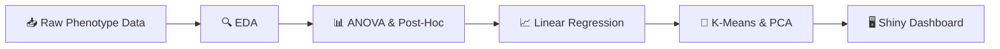
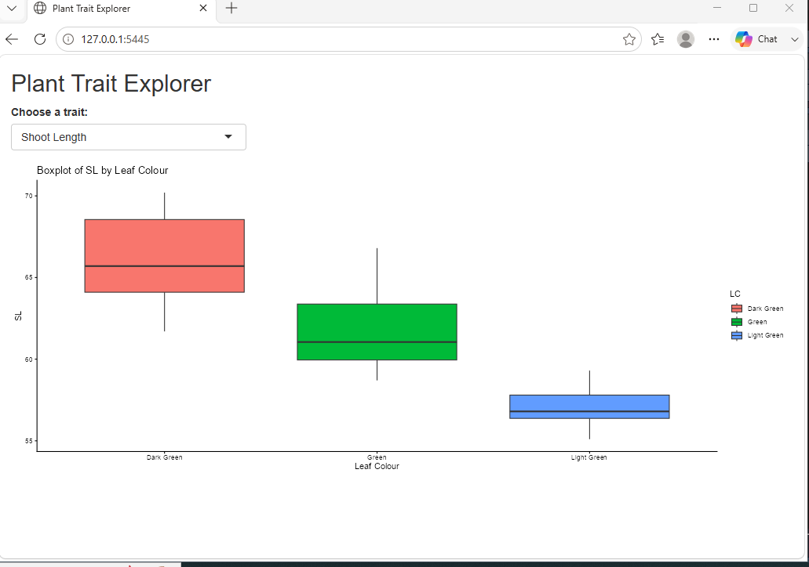

# 🌾 Plant Genotype Phenotypic Analysis in R

> **Measuring 100 plant genotypes and turning trait data into selection decisions** 
> a step-by-step R workflow, from first look at the data to a live decision easy visuals.

*Abiotic Stress Breeder · Trait Selection · Reproducible Pipelines*

[Overview](#-dataset-overview) · [Modules](#-project-modules) · [Workflow](#-workflow-pipeline)

---

## 📊 Dataset Overview

Phenotypic data recorded for **100 plant genotypes** (`G1` – `G100`).
Each genotype is described by one ID and five measured/scored traits:

### 📋 Recorded Variables

| Variable | What it means |
|:---:|---|
| `Genotype` **Genotype ID** | Unique code given to each plant line (`G1` – `G100`) |
| `L` **Length** | Total plant length (height), base to tip in **cm** |
| `B` **Breadth** | Canopy width at its widest point in **cm** |
| `SL` **Shoot Length** | Length of the above-ground shoot in **cm** |
| `RL` **Root Length** | Length of the primary root system in **cm** |
| `LC` **Leaf Colour** | Visual score: *Light Green · Green · Dark Green* |

> 💡 **Field note:** `SL` and `RL` are the standard abbreviations used in seedling-vigor
> research, and `LC` is typically scored against a **Leaf Colour Chart (LCC)** 
> a simple, visual standard developed by IRRI.

---

## 🗂️ Project Modules

Five numbered scripts runnig them in order, each one builds on the previous data.

| SR | Project name | Script name | What it does (in plain words) | Packages |
|:-:|--------|--------|-------------------------------|----------|
| 1 | **Exploratory Data Analysis** | [`exploratory_data_analysis`] | summary stats, correlations, bar & scatter plots | `readxl` `dplyr` `ggplot2` |
| 2 | **ANOVA & Post-Hoc Test** | [`anova_and_posthoc`] | Checks if genotypes truly differ (One-Way ANOVA) and ranks them (Duncan's Test); exports `.png` boxplots | `agricolae` |
| 3 | **Linear Regression** | [`linear_regression`] | Predicts one trait from another, reports R² and residual offsets diagnostics | `stats` `ggplot2` |
| 4 | **Clustering & PCA** | [`genotype_clustering_pca`] | Scales traits (Z-score), groups similar genotypes (K-Means, K = 3), visualizes with PCA biplots | `factoextra` `stats` |
| 5 | **Shiny Dashboard** | [`shiny_dashboard`] | A web app to filter and plot traits — no coding needed to explore | `shiny` `dplyr` `ggplot2` |

### ❓ The Question Each Step Answers

| Step | Question |
|:---:|---|
|  `1` | *What does my data look like?* |
|  `2` | *Are the genotypes really different and which ones are the best?* |
|  `3` | *Can one trait predict another?* *(indirect selection)* |
|  `4` | *Which genotypes are alike and which are diverse enough for crossing?* |
|  `5` | *Can I explore the results without writing code?* |

---

## 🔁 Workflow Pipeline

---
## 📈 Project Results & Showcase
### 5️⃣ Interactive Shiny Dashboard — "Plant Trait Explorer"

**Script:** [`05_shiny_dashboard.R`](./05_shiny_dashboard.R)

**Description:**

This module turns the phenotypic dataset into an **interactive web application** built with R Shiny. The user selects any of the four measured traits (`L`, `B`, `SL`, `RL`) from a dropdown menu, and the app instantly redraws a **boxplot of that trait grouped by Leaf Colour (`LC`)**. The goal is to let anyone explore the results. Launch with `shiny::runApp()` after setting the data path.

---

#### 📊 Results & Outputs

##### How the App Works

*Shows:* The app's two-part structure a frontend that collects input and a backend that reacts to it (runs locally in a browser window)

**📄 Full Report:** [Download the complete dashboard code (PDF)](./results/shiny_dashboard.pdf)

| Layer | Component | What it does |
|---|---|---|
| 🖥️ **UI** | `titlePanel` | Displays the app header *"Plant Trait Explorer"* |
| 🖥️ **UI** | `selectInput` | Dropdown to pick a trait; choice stored as `input$trait` |
| ⚙️ **Server** | `renderPlot` | Rebuilds the plot automatically whenever the dropdown changes |
| ⚙️ **Server** | `ggplot2` boxplot | Plots selected trait by Leaf Colour, boxes filled by group, `theme_classic()` |

**Selectable traits:**

| Dropdown label | Variable code | Unit |
|---|:-:|:-:|
| Height | `L` | cm |
| Breadth | `B` | cm |
| Shoot Length | `SL` | cm |
| Root Length | `RL` | cm |

**Key Findings:**

- **All four traits are explorable** through a single dropdown one control, four views
- **The plot is fully reactive:** changing the trait redraws the boxplot instantly, with title and axis labels updating automatically
- Boxes are **colour coded by leaf colour group**, connecting the app directly to the groups tested in Project 2

---

##### Live Dashboard Preview

*Shows:* The running app (local browser session) with *Shoot Length* selected boxplots of `SL` across the three leaf colour groups for all 100 genotypes

**Interpretation:**

- With *Shoot Length* selected, the app shows the **same group ordering validated by ANOVA in Project 2**  Dark Green (median ≈ 66 cm) > Green (≈ 61 cm) > Light Green (≈ 57 cm)
- Box heights are short and separated **the group differences are large compared with within-group spread**, consistent with the Duncan groupings
- The full analysis pipeline becomes clickable: **any viewer can reach the project conclusions through one dropdown, without writing code**

---

#### 🔍 Key Insights from Project 5:

1. **A working end product:** the app delivers on-demand boxplots for all four traits across the three leaf colour groups, reacting instantly to user input.
2. **Analysis made accessible:** everything found in Projects 1–4 (group differences, trait patterns) can now be explored by collaborators or reviewers who do not use R.
3. **Practical reach:** one screen summarizes all 100 genotypes per group a viewer can move from question to visual answer in a single click.
4. **Limitations to report:** the data path is hard-coded and local (the script notes *"CHANGE THIS PATH if needed"*), and the app currently runs only on the author's machine until deployed.
5. **Basis for further work:** the natural next step is deployment (e.g. shinyapps.io / Posit Connect) and extending the app with the cluster tiers from Project 4 turning the static results into a shareable decision tool.
